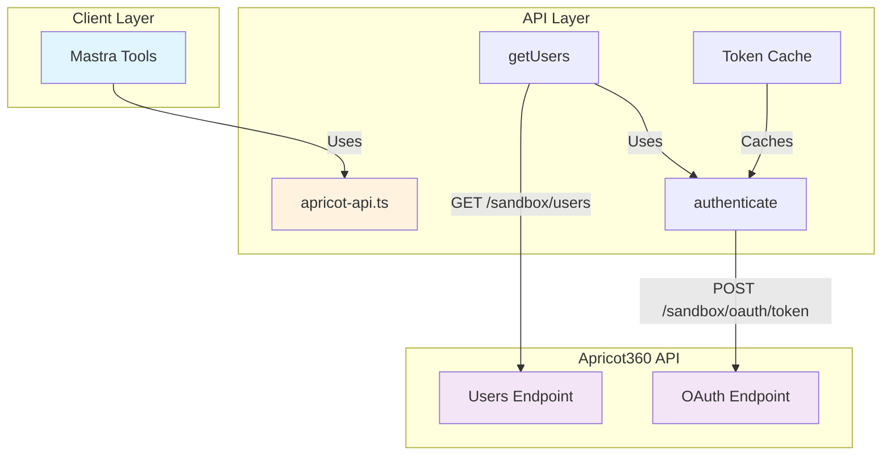
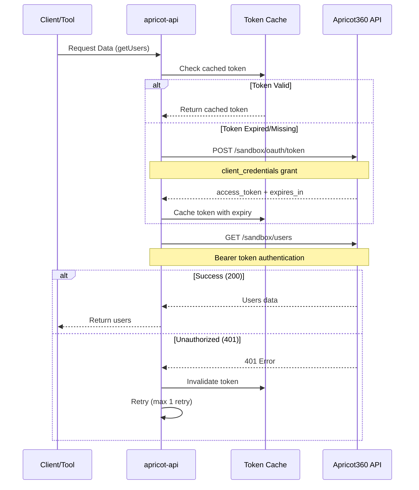
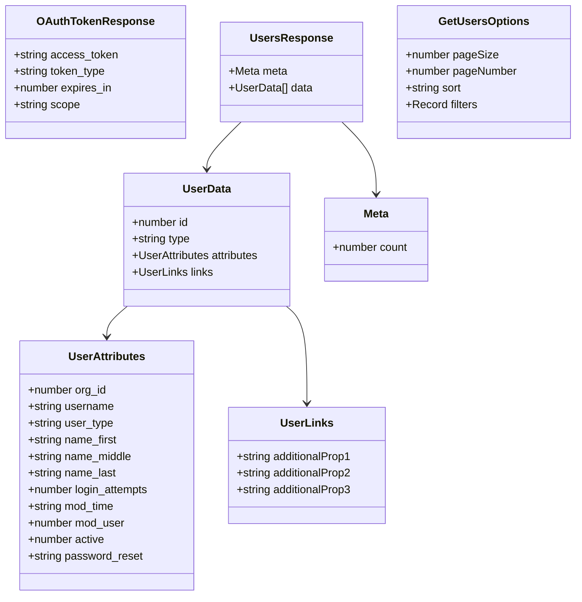
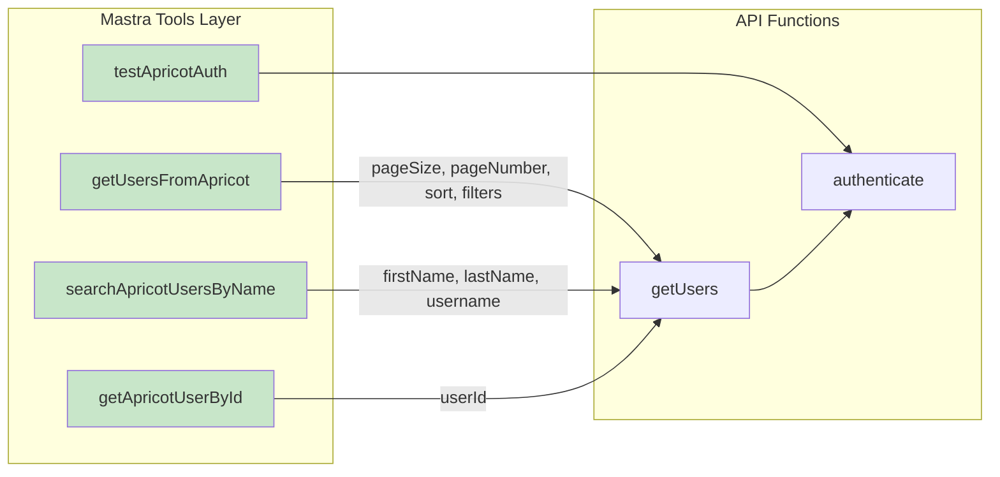
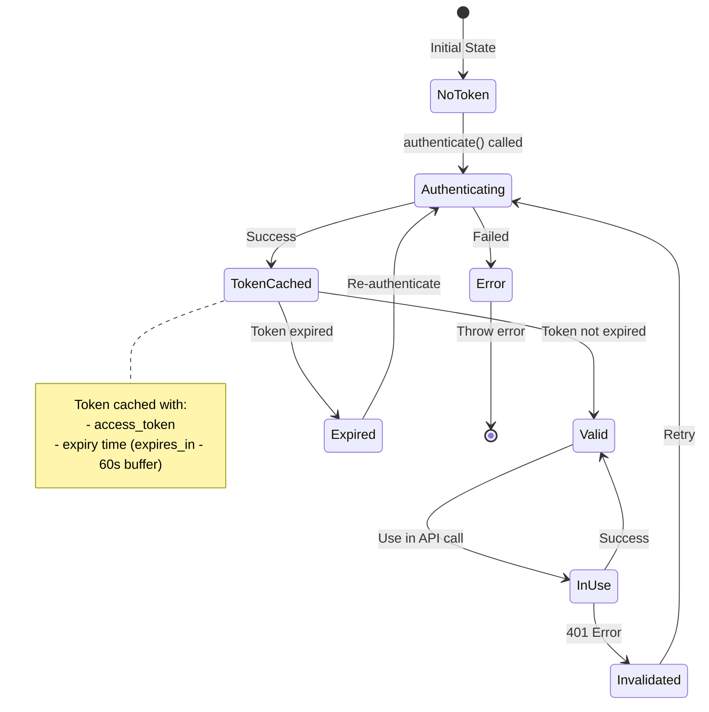

# Apricot360 API Design Documentation

## Architecture Overview



## Authentication Flow



## Data Models



## API Endpoints

### 1. Authentication Endpoint

**Endpoint:** `POST /sandbox/oauth/token`

**Request:**
```json
{
  "grant_type": "client_credentials",
  "client_id": "{APRICOT_CLIENT_ID}",
  "client_secret": "{APRICOT_CLIENT_SECRET}"
}
```

**Response:**
```json
{
  "access_token": "string",
  "token_type": "Bearer",
  "expires_in": 3600,
  "scope": "string"
}
```

### 2. Users Endpoint

**Endpoint:** `GET /sandbox/users`

**Query Parameters:**
- `page[size]` - Number of users per page
- `page[number]` - Page number
- `sort` - Field to sort by (prefix with `-` for descending)
- `filter[fieldname]` - Filter by field value

**Response:**
```json
{
  "meta": {
    "count": 100
  },
  "data": [
    {
      "id": 123,
      "type": "users",
      "attributes": {
        "org_id": 456,
        "username": "john.doe",
        "user_type": "admin",
        "name_first": "John",
        "name_middle": "",
        "name_last": "Doe",
        "login_attempts": 0,
        "mod_time": "2024-01-01T00:00:00Z",
        "mod_user": 789,
        "active": 1,
        "password_reset": ""
      },
      "links": {}
    }
  ]
}
```

## Mastra Tools



### Tool Descriptions

#### 1. `getUsersFromApricot`
- **ID:** `get-users-from-apricot`
- **Purpose:** Fetch users with optional pagination, sorting, and filtering
- **Input:** `pageSize`, `pageNumber`, `sort`, `filters`
- **Output:** Array of users with count and success status

#### 2. `searchApricotUsersByName`
- **ID:** `search-apricot-users-by-name`
- **Purpose:** Search users by first name, last name, or username
- **Input:** `firstName`, `lastName`, `username` (at least one required)
- **Output:** Array of matching users

#### 3. `getApricotUserById`
- **ID:** `get-apricot-user-by-id`
- **Purpose:** Get a specific user by their unique ID
- **Input:** `userId`
- **Output:** Single user object or null if not found

#### 4. `testApricotAuth`
- **ID:** `test-apricot-auth`
- **Purpose:** Test authentication with Apricot360 API
- **Input:** None
- **Output:** Success status, message, and token availability

## Token Management Strategy



## Key Features

### 1. Token Caching
- Tokens are cached in memory with expiration tracking
- 60-second buffer before actual expiry to prevent edge cases
- Automatic invalidation on 401 errors

### 2. Retry Logic
- Automatic retry on 401 (Unauthorized) errors
- Maximum of 1 retry attempt
- Token invalidation before retry

### 3. Query Building
- Dynamic query string construction
- Support for pagination (`page[size]`, `page[number]`)
- Support for sorting (ascending/descending)
- Support for multiple filters

### 4. Error Handling
- Detailed error messages with status codes
- Graceful degradation in tools
- Console logging for debugging

## Environment Variables

Required environment variables:

```bash
APRICOT_API_BASE_URL=https://api.apricot360.com
APRICOT_CLIENT_ID=your_client_id
APRICOT_CLIENT_SECRET=your_client_secret
```

## Error Codes

| Code | Description | Handling |
|------|-------------|----------|
| 200 | Success | Return data |
| 401 | Unauthorized | Invalidate token and retry (once) |
| 4xx | Client error | Throw error with message |
| 5xx | Server error | Throw error with message |

## Best Practices

1. **Always use the tool layer** - Don't call API functions directly unless necessary
2. **Leverage token caching** - The API automatically handles token lifecycle
3. **Use filters wisely** - Apply filters to reduce data transfer
4. **Handle errors gracefully** - All tools return success/error status
5. **Test authentication first** - Use `testApricotAuth` before other operations
