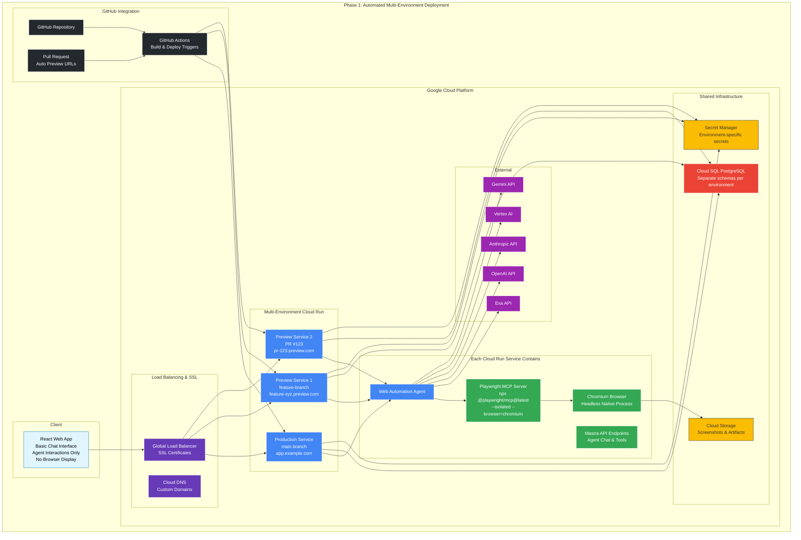

# Production Architecture for Labs ASP

## Overview

This document outlines the production-ready architecture for the Labs ASP web automation application on Google Cloud Platform. The architecture addresses the core requirement of running Playwright browser automation with real-time browser display streaming to users.

## Full Production Architecture

```mermaid
graph TB
    subgraph "Client Layer"
        WEB[Web Client<br/>React/Next.js App<br/>Split Screen: Chat + Browser View]
    end

    subgraph "Google Cloud Platform"
        subgraph "Load Balancing & CDN"
            CLB[Cloud Load Balancer]
            CDN[Cloud CDN]
        end

        subgraph "Application Layer - Cloud Run"
            CR[Mastra Server<br/>Cloud Run Service<br/>Auto-scaling 0-100]
            
            subgraph "Mastra API Endpoints"
                AGENT_API["Agent API<br/>POST /agents/webAutomationAgent/generate<br/>POST /agents/webAutomationAgent/stream"]
                TOOL_API["Tools API<br/>GET /tools<br/>POST /tools/toolId/execute"]
                WS_API["WebSocket API<br/>WS /browser-stream<br/>Browser Display Streaming"]
            end
            
            subgraph "Mastra Components"
                MA[Web Automation Agent]
            end
        end

        subgraph "Browser Infrastructure - GKE"
            subgraph "GKE Cluster"
                subgraph "System Node Pool"
                    SYS[System Pods<br/>DNS, Metrics, Ingress]
                end
                
                subgraph "Browser Node Pool<br/>n1-standard-4 nodes"
                    subgraph "MCP Gateway Pods"
                        MCP1[MCP Gateway 1<br/>Playwright MCP Server<br/>HTTP Endpoints]
                        MCP2[MCP Gateway 2<br/>Playwright MCP Server<br/>HTTP Endpoints]
                        MCP3[MCP Gateway N<br/>Playwright MCP Server<br/>HTTP Endpoints]
                    end
                    
                    subgraph "Browser Session Pods"
                        BS1[Browser Session 1<br/>Chrome + VNC Server<br/>StatefulSet Pod]
                        BS2[Browser Session 2<br/>Chrome + VNC Server<br/>StatefulSet Pod]
                        BS3[Browser Session N<br/>Chrome + VNC Server<br/>StatefulSet Pod]
                    end
                end
                
                MCPSVC[Internal MCP Service<br/>LoadBalancer<br/>Routes to MCP Gateways]
                VNCSVC[VNC Streaming Service<br/>WebSocket Proxy<br/>Routes to Browser Pods]
            end
        end

        subgraph "Data Layer"
            PSQL[Cloud SQL PostgreSQL<br/>Private IP<br/>Mastra Storage + Memory]
            REDIS[Cloud Memorystore Redis<br/>Session Mapping<br/>Browser State Cache<br/>WebSocket Connections]
        end

        subgraph "Storage & Secrets"
            AR[Artifact Registry<br/>Container Images]
            SM[Secret Manager<br/>API Keys & Secrets]
            CS[Cloud Storage<br/>Screenshots & Artifacts]
        end

        subgraph "Networking"
            VPC[Private VPC Network]
            PSC[Private Service Connect]
            NAT[Cloud NAT<br/>Outbound Internet]
        end

        subgraph "Monitoring & Logging"
            GCM[Cloud Monitoring<br/>Metrics & Alerts]
            GCL[Cloud Logging<br/>Centralized Logs]
            APM[Cloud Trace<br/>Distributed Tracing]
        end
    end

    subgraph "External Services"
        EXA[Exa API<br/>Web Search]
        OPENAI[OpenAI API<br/>GPT Models]
        ANTHROPIC[Anthropic API<br/>Claude Models]
        VERTEX[Vertex AI<br/>Google Cloud AI]
        GEMINI[Gemini API<br/>Google AI Models]
    end

    %% Client Connections
    WEB --> CLB
    CLB --> CDN
    CDN --> CR

    %% Client API Usage
    WEB --> AGENT_API
    WEB --> TOOL_API
    WEB --> WS_API

    %% Mastra Server Internal
    CR --> MA

    %% MCP Connections (Agent to MCP Gateway)
    MA --> MCPSVC
    MCPSVC --> MCP1
    MCPSVC --> MCP2
    MCPSVC --> MCP3

    %% Browser Session Management (MCP Gateway controls Browser Pods)
    MCP1 -.->|Controls| BS1
    MCP2 -.->|Controls| BS2
    MCP3 -.->|Controls| BS3

    %% Browser Streaming (Client to Browser Display)
    WS_API --> VNCSVC
    VNCSVC --> BS1
    VNCSVC --> BS2
    VNCSVC --> BS3

    %% Data Connections
    CR --> PSQL
    CR --> REDIS
    MCP1 --> REDIS
    MCP2 --> REDIS
    MCP3 --> REDIS
    WS_API --> REDIS

    %% External API Connections
    MA --> EXA
    MA --> OPENAI
    MA --> ANTHROPIC
    MA --> VERTEX
    MA --> GEMINI

    %% Storage Connections
    CR --> CS
    BS1 --> CS
    BS2 --> CS
    BS3 --> CS

    %% Monitoring
    CR --> GCM
    MCP1 --> GCL
    MCP2 --> GCL
    MCP3 --> GCL

    %% Styling
    classDef client fill:#e1f5fe,stroke:#0277bd,color:#000
    classDef cloudRun fill:#4285f4,stroke:#fff,color:#fff
    classDef gke fill:#0f9d58,stroke:#fff,color:#fff
    classDef database fill:#ea4335,stroke:#fff,color:#fff
    classDef storage fill:#fbbc04,stroke:#333,color:#333
    classDef external fill:#9c27b0,stroke:#fff,color:#fff
    classDef network fill:#607d8b,stroke:#fff,color:#fff
    classDef api fill:#ff9800,stroke:#fff,color:#fff
    
    class WEB client
    class CR,MA cloudRun
    class MCP1,MCP2,MCP3,BS1,BS2,BS3,MCPSVC,VNCSVC gke
    class PSQL,REDIS database
    class AR,SM,CS storage
    class EXA,OPENAI,ANTHROPIC,VERTEX,GEMINI external
    class VPC,PSC,NAT network
    class AGENT_API,TOOL_API,WS_API api
```



## Architecture Components

### Client Layer
- **Web Client**: React/Next.js application with split-screen interface
  - Left panel: Chat interface for agent interactions
  - Right panel: Real-time browser display via WebSocket streaming

### Application Layer (Cloud Run)
- **Mastra Server**: Auto-scaling HTTP server (0-100 instances)
  - Web Automation Agent
  - REST API endpoints
  - WebSocket server for browser streaming

### Browser Infrastructure (GKE)
- **MCP Gateway Pods**: Stateless HTTP servers implementing Playwright MCP protocol
- **Browser Session Pods**: StatefulSets with Chrome + VNC for persistent browser sessions
- **Internal Services**: Load balancers for MCP communication and VNC streaming

### Data Layer
- **Cloud SQL PostgreSQL**: Mastra storage and memory (private IP)
- **Cloud Memorystore Redis**: Session mapping, browser state cache, WebSocket connections

### Storage & Secrets
- **Artifact Registry**: Container images
- **Secret Manager**: API keys and secrets
- **Cloud Storage**: Screenshots and automation artifacts

## API Endpoints

Based on Mastra documentation, the client uses these endpoints:

### Agent Interactions (Chat Panel)
- `POST /agents/webAutomationAgent/generate` - Generate agent response
- `POST /agents/webAutomationAgent/stream` - Stream agent responses
- `GET /agents/webAutomationAgent` - Get agent details

### Tool Management
- `GET /tools` - List available tools
- `POST /tools/{toolId}/execute` - Execute specific tool

### Browser Streaming (Custom)
- `WS /browser-stream` - WebSocket endpoint for real-time browser display

## Data Flow

1. **User Input**: Client sends chat message to Mastra API
2. **Agent Processing**: Web Automation Agent processes request and calls MCP Gateway
3. **Browser Automation**: MCP Gateway controls browser session pod via Playwright
4. **Visual Streaming**: VNC captures browser display and streams via WebSocket
5. **State Management**: Redis coordinates sessions between components
6. **Artifact Storage**: Screenshots and results stored in Cloud Storage

## Component Responsibilities

### MCP Gateway Pods
- **Purpose**: HTTP servers implementing Model Context Protocol for Playwright
- **Function**: Translate MCP calls into Playwright commands, manage browser lifecycle
- **Scaling**: Stateless, can scale independently based on demand

### Browser Session Pods (StatefulSets)
- **Purpose**: Actual browser runtime environments
- **Components**:
  - Chrome Browser: Chromium instance for web automation
  - VNC Server: Captures browser display for streaming
  - Playwright Runtime: Executes browser automation commands
- **Persistence**: StatefulSets maintain browser state (cookies, navigation, downloads)

### Redis Coordination Layer
```
Session Mapping:
session_123 -> {
  mcpGatewayPod: "mcp-gateway-2",
  browserPod: "browser-session-5", 
  userId: "user_456",
  websocketId: "ws_789"
}

Browser State Cache:
browser_session_5 -> {
  currentUrl: "https://example.com",
  cookies: [...],
  localStorage: {...},
  lastActivity: "2024-01-15T10:30:00Z"
}
```

## Client Implementation

### Mastra Client SDK Usage
```typescript
// Initialize client
const mastraClient = new MastraClient({
  baseUrl: "https://your-cloud-run-url.run.app"
});

// Get agent instance
const webAutomationAgent = mastraClient.getAgent("webAutomationAgent");

// Stream agent responses (Chat Panel)
const response = await webAutomationAgent.stream({
  messages: [{ role: "user", content: "Navigate to google.com" }]
});

response.processDataStream({
  onTextPart: (text) => setChatMessages(prev => [...prev, text]),
  onToolCallPart: (toolCall) => console.log('Tool:', toolCall.toolName)
});

// Browser streaming (Browser View Panel)
const ws = new WebSocket('wss://your-cloud-run-url.run.app/browser-stream');
ws.onmessage = (event) => {
  const frame = JSON.parse(event.data);
  renderBrowserFrame(frame);
};
```

### Split-Screen UI Layout
```
┌─────────────────┬─────────────────┐
│   Chat Panel    │  Browser View   │
│                 │                 │
│ Agent Messages  │ Live Browser    │
│ Tool Calls      │ WebSocket       │
│ User Input      │ Stream          │
│                 │                 │
│ REST API        │ WebSocket API   │
│ Calls           │ Connection      │
└─────────────────┴─────────────────┘
```

## Why VNC?

VNC is essential for browser visualization:
1. **Visual Display**: Chrome runs headless, users need to see browser actions
2. **Real-time Streaming**: Captures browser output frame-by-frame
3. **WebSocket Conversion**: VNC frames converted to WebSocket for client
4. **Future Interaction**: Enables potential user interaction with browser view

## Benefits Over Current Approach

1. **Proper Container Orchestration**: GKE vs custom VM management
2. **Session Persistence**: StatefulSets vs ephemeral instances  
3. **Real-time Streaming**: WebSocket browser display vs no visualization
4. **Scalable Architecture**: Independent scaling of components
5. **State Management**: Redis coordination vs no session management
6. **Client Application**: Complete user interface vs API-only

## Phase 1: Production Deployment

### Requirements

**Infrastructure:**
- GCP Project with billing enabled
- Cloud Run (1-2 vCPU, 1-2GB RAM per instance)
- Cloud SQL PostgreSQL (db-f1-micro, 10GB)
- Secret Manager
- Cloud Storage bucket
- Artifact Registry repository
- Cloud DNS (for custom domains)
- Global Load Balancer (for SSL and routing)

**Development:**
- Node.js 20+
- GitHub Actions (CI/CD)
- gcloud CLI
- Domain name (optional, for custom URLs)

**API Keys:**
- OpenAI, Anthropic, Vertex AI, Gemini, Exa API tokens

### Phase 1 Architecture

Phase 1 provides automated deployment with per-commit builds and preview environments:



**Key Features:**
- **Per-Commit Deployments**: Every push creates a unique deployment with its own URL
- **Preview URLs**: Automatic preview environments for PRs and feature branches  
- **Native Node.js**: No Docker complexity - runs directly on Cloud Run Node.js runtime
- **Headless Browsing**: Playwright MCP with screenshots stored in Cloud Storage
- **Multi-Schema Database**: Separate database schemas for each environment
- **Automatic Cleanup**: Old deployments automatically pruned

**Infrastructure Components:**
- **GitHub Actions**: Automated build and deployment pipeline
- **Multi-Environment Cloud Run**: Separate services for production and previews
- **Global Load Balancer**: SSL termination and custom domain routing
- **Cloud SQL**: Multi-schema PostgreSQL for environment isolation
- **Cloud Storage**: Screenshots and artifacts from browser automation

### Benefits

1. **Production-Ready**: Automated deployment pipeline with per-commit builds
2. **Developer Experience**: Automatic preview URLs for every PR and branch
3. **Cost Effective**: Pay only for what you use with Cloud Run auto-scaling
4. **No Docker Complexity**: Native Node.js deployment reduces operational overhead
5. **Instant Feedback**: Stakeholders can review changes immediately via preview URLs
6. **Automatic Cleanup**: Resource management handled automatically
7. **Evolution Path**: Foundation for adding browser streaming in Phase 2

### Phase 1 Limitations

- **No Browser Display**: Screenshots only, no real-time streaming
- **Agent Interactions Only**: Chat-based automation without visual feedback
- **No Session Persistence**: Each browser automation starts fresh
- **Single User Focus**: No multi-user session management yet

### Cloud Run Capabilities for Playwright

**Fully Supported:**
- **Timeout**: Up to 60 minutes per request (configurable: `--timeout=60m`)
- **Resources**: Up to 8 vCPUs, 32GB RAM, 32GB disk (2nd generation)
- **Browser Support**: Chromium headless pre-installed and optimized
- **Auto-scaling**: 0-100 instances, pay-per-request pricing
- **Session Pattern**: Perfect for request/response automations under 60 minutes

**Optimal Configuration:**
```yaml
resources:
  cpu: "2000m"     # 2 vCPUs for browser + Node.js
  memory: "4Gi"    # 4GB RAM for Chrome processes
timeout: "3600s"   # 60 minute maximum
```

**Recommendation**: Cloud Run is ideal for Phase 1 - no Docker complexity needed, native Node.js deployment with excellent Playwright support.

### Client Application (Phase 1)

Simple React app with:
```typescript
// Basic chat interface only
const response = await webAutomationAgent.stream({
  messages: [{ role: "user", content: "Navigate to google.com" }]
});

// Display agent responses and tool calls
response.processDataStream({
  onTextPart: (text) => addToChat(text),
  onToolCallPart: (tool) => showToolExecution(tool)
});
```

## Full Production Architecture Requirements

**Infrastructure:**
- GCP Project with billing enabled
- GKE cluster (3 nodes minimum: 1 system, 2+ browser workload)
- Cloud Run (auto-scaling 0-100 instances)
- Cloud SQL PostgreSQL (db-standard-2, 100GB+, regional HA)
- Cloud Memorystore Redis (1GB+)
- VPC with private subnets and NAT Gateway
- Cloud Load Balancer with SSL certificates
- Secret Manager, Cloud Storage, Artifact Registry

**Development:**
- All POC requirements plus:
- Kubernetes knowledge
- WebSocket/WebRTC experience
- VNC server configuration

**Monitoring:**
- Cloud Monitoring, Logging, Trace
- Custom dashboards and alerting
- SLA monitoring (99.9% uptime target)

## Full Deployment Strategy

1. **Phase 1**: Basic POC with Cloud Run + Docker sidecar ← **Start Here**
2. **Phase 2**: Add WebSocket browser streaming and Redis
3. **Phase 3**: Migrate to GKE with separate MCP Gateway and Browser pods
4. **Phase 4**: Add advanced features (user interaction, recording, etc.)

## Monitoring & Observability

- **Cloud Monitoring**: Metrics and alerts for all components
- **Cloud Logging**: Centralized logging from Mastra server and MCP gateways
- **Cloud Trace**: Distributed tracing for request flows
- **Custom Dashboards**: Browser session metrics, MCP performance, WebSocket connections

This architecture provides a production-ready, scalable solution for web automation with real-time browser visualization while maintaining the flexibility and power of the Mastra framework.
