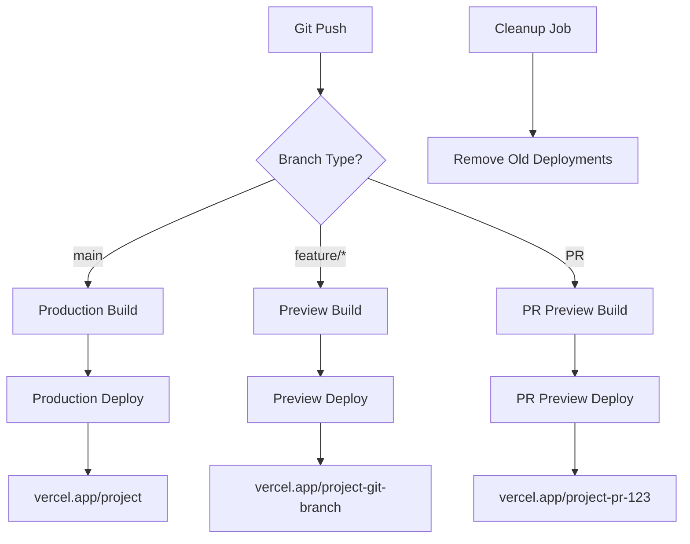

# Vercel-Style Deployment Architecture

## Overview

This document outlines how to implement Vercel's elegant deployment pattern where every commit gets its own build and deployment, with automatic preview environments and seamless production deployments.

## How Vercel Does It

### Core Principles
1. **Every Commit = New Build**: Each git commit triggers an isolated build and deployment
2. **Branch-Based Environments**: Different deployment targets based on git branches
3. **Ephemeral Preview URLs**: Temporary URLs for feature branches and pull requests
4. **Zero-Downtime Production**: Atomic deployments with instant rollbacks
5. **Automatic Cleanup**: Old deployments are automatically pruned

### Vercel's Technical Architecture



---

## Our Implementation Strategy

### Architecture Overview

We'll replicate this using:
- **Google Cloud Run**: For containerized deployments (similar to Vercel's serverless functions)
- **Cloud Build**: For build triggers and CI/CD
- **Cloud DNS**: For custom domains and routing
- **GitHub Actions**: For orchestration and integration
- **Terraform**: For infrastructure management

### Core Components

```
┌─────────────────┐    ┌──────────────────┐    ┌─────────────────┐
│   GitHub Repo   │ -> │  GitHub Actions  │ -> │  Google Cloud   │
│                 │    │                  │    │                 │
│ • main branch   │    │ • Build trigger  │    │ • Cloud Run     │
│ • feature/*     │    │ • Deploy logic   │    │ • Load Balancer │
│ • pull requests │    │ • Environment    │    │ • Cloud DNS     │
└─────────────────┘    └──────────────────┘    └─────────────────┘
```

---

## Implementation Plan

### 1. Cloud Run Service Architecture

```hcl
# terraform/modules/cloud-run/main.tf
resource "google_cloud_run_service" "app" {
  name     = "${var.service_name}-${var.environment}-${var.deployment_id}"
  location = var.region
  
  template {
    metadata {
      annotations = {
        "autoscaling.knative.dev/maxScale" = var.max_instances
        "run.googleapis.com/execution-environment" = "gen2"
      }
      labels = {
        environment   = var.environment
        deployment-id = var.deployment_id
        branch       = var.git_branch
        commit-sha   = var.git_sha
      }
    }
    
    spec {
      containers {
        image = var.container_image
        
        env {
          name  = "ENVIRONMENT"
          value = var.environment
        }
        
        env {
          name  = "DEPLOYMENT_ID"
          value = var.deployment_id
        }
        
        env {
          name = "DATABASE_URL"
          value_from {
            secret_key_ref {
              name = "database-url-${var.environment}"
              key  = "latest"
            }
          }
        }
        
        resources {
          limits = {
            cpu    = var.cpu_limit
            memory = var.memory_limit
          }
        }
      }
      
      service_account_name = var.service_account_email
    }
  }
  
  traffic {
    percent         = 100
    latest_revision = true
  }
}

# Generate unique URL for this deployment
resource "google_cloud_run_domain_mapping" "deployment_url" {
  count    = var.environment == "preview" ? 1 : 0
  location = var.region
  name     = "${var.deployment_id}.${var.base_domain}"
  
  spec {
    route_name = google_cloud_run_service.app.name
  }
}
```

### 2. GitHub Actions Workflow

```yaml
# .github/workflows/deploy.yml
name: Vercel-Style Deploy

on:
  push:
    branches: ['**']
  pull_request:
    types: [opened, synchronize, reopened]

env:
  PROJECT_ID: ${{ secrets.GCP_PROJECT_ID }}
  GAR_LOCATION: us-central1
  REPOSITORY: mastra-app
  SERVICE: mastra-app

jobs:
  determine-environment:
    runs-on: ubuntu-latest
    outputs:
      environment: ${{ steps.env.outputs.environment }}
      deployment_id: ${{ steps.env.outputs.deployment_id }}
      base_url: ${{ steps.env.outputs.base_url }}
      should_deploy: ${{ steps.env.outputs.should_deploy }}
    steps:
      - name: Determine deployment environment
        id: env
        run: |
          if [ "${{ github.event_name }}" == "pull_request" ]; then
            echo "environment=preview" >> $GITHUB_OUTPUT
            echo "deployment_id=pr-${{ github.event.number }}" >> $GITHUB_OUTPUT
            echo "base_url=pr-${{ github.event.number }}.mastra-app.dev" >> $GITHUB_OUTPUT
            echo "should_deploy=true" >> $GITHUB_OUTPUT
          elif [ "${{ github.ref }}" == "refs/heads/main" ]; then
            echo "environment=production" >> $GITHUB_OUTPUT
            echo "deployment_id=prod" >> $GITHUB_OUTPUT
            echo "base_url=mastra-app.com" >> $GITHUB_OUTPUT
            echo "should_deploy=true" >> $GITHUB_OUTPUT
          elif [[ "${{ github.ref }}" == refs/heads/* ]]; then
            BRANCH_NAME=$(echo ${{ github.ref }} | sed 's/refs\/heads\///')
            SAFE_BRANCH=$(echo $BRANCH_NAME | sed 's/[^a-zA-Z0-9]/-/g' | tr '[:upper:]' '[:lower:]')
            echo "environment=preview" >> $GITHUB_OUTPUT
            echo "deployment_id=branch-${SAFE_BRANCH}" >> $GITHUB_OUTPUT
            echo "base_url=${SAFE_BRANCH}.mastra-app.dev" >> $GITHUB_OUTPUT
            echo "should_deploy=true" >> $GITHUB_OUTPUT
          else
            echo "should_deploy=false" >> $GITHUB_OUTPUT
          fi

  build-and-deploy:
    needs: determine-environment
    if: needs.determine-environment.outputs.should_deploy == 'true'
    runs-on: ubuntu-latest
    environment: ${{ needs.determine-environment.outputs.environment }}
    
    steps:
      - name: Checkout
        uses: actions/checkout@v4

      - name: Set up Node.js
        uses: actions/setup-node@v4
        with:
          node-version: '20'
          cache: 'pnpm'

      - name: Install dependencies
        run: pnpm install --frozen-lockfile

      - name: Run tests
        run: pnpm test

      - name: Build application
        run: pnpm build
        env:
          NEXT_PUBLIC_DEPLOYMENT_ID: ${{ needs.determine-environment.outputs.deployment_id }}
          NEXT_PUBLIC_BASE_URL: ${{ needs.determine-environment.outputs.base_url }}

      - name: Google Auth
        id: auth
        uses: google-github-actions/auth@v2
        with:
          credentials_json: '${{ secrets.GCP_SA_KEY }}'

      - name: Set up Cloud SDK
        uses: google-github-actions/setup-gcloud@v2

      - name: Configure Docker to use gcloud as a credential helper
        run: gcloud auth configure-docker $GAR_LOCATION-docker.pkg.dev

      - name: Build and push container
        run: |
          IMAGE_TAG="${GAR_LOCATION}-docker.pkg.dev/${PROJECT_ID}/${REPOSITORY}/${SERVICE}:${{ needs.determine-environment.outputs.deployment_id }}-${{ github.sha }}"
          
          docker build \
            --build-arg DEPLOYMENT_ID="${{ needs.determine-environment.outputs.deployment_id }}" \
            --build-arg ENVIRONMENT="${{ needs.determine-environment.outputs.environment }}" \
            -t $IMAGE_TAG .
          
          docker push $IMAGE_TAG
          
          echo "IMAGE_TAG=$IMAGE_TAG" >> $GITHUB_ENV

      - name: Deploy to Cloud Run
        run: |
          gcloud run deploy ${{ needs.determine-environment.outputs.deployment_id }}-mastra-app \
            --image $IMAGE_TAG \
            --region $GAR_LOCATION \
            --allow-unauthenticated \
            --set-env-vars="DEPLOYMENT_ID=${{ needs.determine-environment.outputs.deployment_id }},ENVIRONMENT=${{ needs.determine-environment.outputs.environment }}" \
            --labels="environment=${{ needs.determine-environment.outputs.environment }},deployment-id=${{ needs.determine-environment.outputs.deployment_id }},branch=$(echo ${{ github.ref_name }} | sed 's/[^a-zA-Z0-9]/-/g'),commit-sha=${{ github.sha }}" \
            --max-instances=10 \
            --memory=2Gi \
            --cpu=2 \
            --port=3000

      - name: Get service URL
        id: get-url
        run: |
          SERVICE_URL=$(gcloud run services describe ${{ needs.determine-environment.outputs.deployment_id }}-mastra-app --region=$GAR_LOCATION --format='value(status.url)')
          echo "SERVICE_URL=$SERVICE_URL" >> $GITHUB_OUTPUT
          echo "service_url=$SERVICE_URL" >> $GITHUB_ENV

      - name: Set up custom domain (preview only)
        if: needs.determine-environment.outputs.environment == 'preview'
        run: |
          # Map custom domain to the service
          gcloud run domain-mappings create \
            --service=${{ needs.determine-environment.outputs.deployment_id }}-mastra-app \
            --domain=${{ needs.determine-environment.outputs.base_url }} \
            --region=$GAR_LOCATION || true

      - name: Update PR with deployment info
        if: github.event_name == 'pull_request'
        uses: actions/github-script@v7
        with:
          script: |
            const deploymentUrl = '${{ steps.get-url.outputs.SERVICE_URL }}';
            const customUrl = '${{ needs.determine-environment.outputs.base_url }}';
            
            const body = `
            ## 🚀 Deployment Ready
            
            Your changes have been deployed to a preview environment:
            
            - **Preview URL**: ${deploymentUrl}
            - **Custom URL**: https://${customUrl} (may take a few minutes to propagate)
            - **Environment**: \`${{ needs.determine-environment.outputs.environment }}\`
            - **Deployment ID**: \`${{ needs.determine-environment.outputs.deployment_id }}\`
            - **Commit**: \`${{ github.sha }}\`
            
            The deployment will be automatically cleaned up when this PR is closed.
            `;
            
            // Find existing comment
            const comments = await github.rest.issues.listComments({
              owner: context.repo.owner,
              repo: context.repo.repo,
              issue_number: context.issue.number,
            });
            
            const existingComment = comments.data.find(comment => 
              comment.body.includes('🚀 Deployment Ready')
            );
            
            if (existingComment) {
              // Update existing comment
              await github.rest.issues.updateComment({
                owner: context.repo.owner,
                repo: context.repo.repo,
                comment_id: existingComment.id,
                body: body
              });
            } else {
              // Create new comment
              await github.rest.issues.createComment({
                owner: context.repo.owner,
                repo: context.repo.repo,
                issue_number: context.issue.number,
                body: body
              });
            }

  cleanup-old-deployments:
    needs: [determine-environment, build-and-deploy]
    if: always() && needs.determine-environment.outputs.should_deploy == 'true'
    runs-on: ubuntu-latest
    steps:
      - name: Google Auth
        uses: google-github-actions/auth@v2
        with:
          credentials_json: '${{ secrets.GCP_SA_KEY }}'

      - name: Set up Cloud SDK
        uses: google-github-actions/setup-gcloud@v2

      - name: Cleanup old deployments
        run: |
          # Keep last 5 deployments for each environment
          ENVIRONMENT="${{ needs.determine-environment.outputs.environment }}"
          
          # Get all services with the environment label
          SERVICES=$(gcloud run services list \
            --filter="metadata.labels.environment=$ENVIRONMENT" \
            --format="value(metadata.name)" \
            --region=$GAR_LOCATION)
          
          for SERVICE_NAME in $SERVICES; do
            # Get creation time and sort by age
            REVISIONS=$(gcloud run revisions list \
              --service=$SERVICE_NAME \
              --region=$GAR_LOCATION \
              --sort-by="~metadata.creationTimestamp" \
              --format="value(metadata.name)")
            
            # Keep first 5, delete the rest
            echo "$REVISIONS" | tail -n +6 | while read REVISION; do
              if [ ! -z "$REVISION" ]; then
                echo "Deleting old revision: $REVISION"
                gcloud run revisions delete $REVISION --region=$GAR_LOCATION --quiet || true
              fi
            done
          done

  cleanup-pr-deployments:
    if: github.event_name == 'pull_request' && github.event.action == 'closed'
    runs-on: ubuntu-latest
    steps:
      - name: Google Auth
        uses: google-github-actions/auth@v2
        with:
          credentials_json: '${{ secrets.GCP_SA_KEY }}'

      - name: Set up Cloud SDK
        uses: google-github-actions/setup-gcloud@v2

      - name: Delete PR deployment
        run: |
          DEPLOYMENT_ID="pr-${{ github.event.number }}"
          SERVICE_NAME="${DEPLOYMENT_ID}-mastra-app"
          
          # Delete the Cloud Run service
          gcloud run services delete $SERVICE_NAME \
            --region=$GAR_LOCATION \
            --quiet || true
          
          # Delete domain mapping
          gcloud run domain-mappings delete \
            --domain="${DEPLOYMENT_ID}.mastra-app.dev" \
            --region=$GAR_LOCATION \
            --quiet || true
          
          # Delete container images
          gcloud artifacts docker images delete \
            "${GAR_LOCATION}-docker.pkg.dev/${PROJECT_ID}/${REPOSITORY}/${SERVICE}:${DEPLOYMENT_ID}-*" \
            --quiet || true

      - name: Update PR with cleanup info
        uses: actions/github-script@v7
        with:
          script: |
            await github.rest.issues.createComment({
              owner: context.repo.owner,
              repo: context.repo.repo,
              issue_number: context.issue.number,
              body: '🧹 Preview deployment has been cleaned up automatically.'
            });
```

### 3. Enhanced Dockerfile for Vercel-Style Deployments

```dockerfile
# Dockerfile
FROM node:20-alpine AS base

# Install dependencies only when needed
FROM base AS deps
RUN apk add --no-cache libc6-compat
WORKDIR /app

# Install dependencies
COPY package.json pnpm-lock.yaml* ./
RUN corepack enable pnpm && pnpm i --frozen-lockfile

# Rebuild the source code only when needed
FROM base AS builder
WORKDIR /app
COPY --from=deps /app/node_modules ./node_modules
COPY . .

# Build arguments for deployment info
ARG DEPLOYMENT_ID
ARG ENVIRONMENT
ARG NEXT_PUBLIC_DEPLOYMENT_ID
ARG NEXT_PUBLIC_BASE_URL

ENV NEXT_PUBLIC_DEPLOYMENT_ID=$NEXT_PUBLIC_DEPLOYMENT_ID
ENV NEXT_PUBLIC_BASE_URL=$NEXT_PUBLIC_BASE_URL
ENV DEPLOYMENT_ID=$DEPLOYMENT_ID
ENV ENVIRONMENT=$ENVIRONMENT

RUN corepack enable pnpm && pnpm build

# Production image, copy all the files and run next
FROM base AS runner
WORKDIR /app

ENV NODE_ENV=production

RUN addgroup --system --gid 1001 nodejs
RUN adduser --system --uid 1001 nextjs

COPY --from=builder /app/public ./public

# Set the correct permission for prerender cache
RUN mkdir .next
RUN chown nextjs:nodejs .next

# Automatically leverage output traces to reduce image size
COPY --from=builder --chown=nextjs:nodejs /app/.next/standalone ./
COPY --from=builder --chown=nextjs:nodejs /app/.next/static ./.next/static

USER nextjs

EXPOSE 3000

ENV PORT=3000
ENV HOSTNAME="0.0.0.0"

# Add deployment info as environment variables
ENV DEPLOYMENT_ID=$DEPLOYMENT_ID
ENV ENVIRONMENT=$ENVIRONMENT

CMD ["node", "server.js"]
```

### 4. URL Routing Strategy

```hcl
# terraform/modules/load-balancer/main.tf
resource "google_compute_global_address" "main" {
  name = "${var.project_name}-global-ip"
}

resource "google_compute_managed_ssl_certificate" "main" {
  name = "${var.project_name}-ssl-cert"
  
  managed {
    domains = [
      var.production_domain,
      "*.${var.preview_domain}"
    ]
  }
}

resource "google_compute_url_map" "main" {
  name            = "${var.project_name}-url-map"
  default_service = google_compute_backend_service.production.id
  
  host_rule {
    hosts        = [var.production_domain]
    path_matcher = "production"
  }
  
  host_rule {
    hosts        = ["*.${var.preview_domain}"]
    path_matcher = "preview"
  }
  
  path_matcher {
    name            = "production"
    default_service = google_compute_backend_service.production.id
  }
  
  path_matcher {
    name            = "preview"
    default_service = google_compute_backend_service.preview.id
    
    # Route to specific preview deployments based on subdomain
    dynamic "route_rule" {
      for_each = var.preview_deployments
      content {
        priority = 1
        match_rule {
          prefix_match = "/"
          header_match {
            name  = "host"
            exact_match = "${route_rule.value.deployment_id}.${var.preview_domain}"
          }
        }
        route_action {
          weighted_backend_service {
            backend_service = route_rule.value.backend_service_id
            weight         = 100
          }
        }
      }
    }
  }
}
```

### 5. Database Strategy for Multi-Deployment

```typescript
// src/lib/database.ts
export class DatabaseManager {
  private static instance: DatabaseManager;
  private prisma: PrismaClient;
  
  constructor() {
    const deploymentId = process.env.DEPLOYMENT_ID || 'default';
    const environment = process.env.ENVIRONMENT || 'development';
    
    // Use different database schemas for different deployments
    const databaseUrl = this.getDatabaseUrl(environment, deploymentId);
    
    this.prisma = new PrismaClient({
      datasources: {
        db: {
          url: databaseUrl
        }
      }
    });
  }
  
  private getDatabaseUrl(environment: string, deploymentId: string): string {
    const baseUrl = process.env.DATABASE_URL;
    
    if (environment === 'production') {
      return baseUrl; // Use main production database
    }
    
    if (environment === 'preview') {
      // Use separate schema for each preview deployment
      return `${baseUrl}?schema=preview_${deploymentId.replace(/[^a-zA-Z0-9]/g, '_')}`;
    }
    
    return baseUrl;
  }
  
  async ensureSchema(): Promise<void> {
    const deploymentId = process.env.DEPLOYMENT_ID || 'default';
    const environment = process.env.ENVIRONMENT || 'development';
    
    if (environment === 'preview') {
      const schemaName = `preview_${deploymentId.replace(/[^a-zA-Z0-9]/g, '_')}`;
      
      // Create schema if it doesn't exist
      await this.prisma.$executeRaw`CREATE SCHEMA IF NOT EXISTS ${Prisma.raw(schemaName)}`;
      
      // Run migrations for this schema
      await this.runMigrationsForSchema(schemaName);
    }
  }
  
  private async runMigrationsForSchema(schemaName: string): Promise<void> {
    // Implementation for running Prisma migrations on specific schema
    // This would involve setting the schema in the DATABASE_URL and running migrations
  }
}
```

### 6. Cleanup and Resource Management

```yaml
# .github/workflows/cleanup.yml
name: Cleanup Old Deployments

on:
  schedule:
    - cron: '0 2 * * *' # Daily at 2 AM
  workflow_dispatch:

jobs:
  cleanup:
    runs-on: ubuntu-latest
    steps:
      - name: Google Auth
        uses: google-github-actions/auth@v2
        with:
          credentials_json: '${{ secrets.GCP_SA_KEY }}'

      - name: Set up Cloud SDK
        uses: google-github-actions/setup-gcloud@v2

      - name: Cleanup old preview deployments
        run: |
          # Get all preview deployments older than 7 days
          CUTOFF_DATE=$(date -d '7 days ago' --iso-8601)
          
          gcloud run services list \
            --filter="metadata.labels.environment=preview AND metadata.creationTimestamp<'${CUTOFF_DATE}'" \
            --format="value(metadata.name)" \
            --region=us-central1 | while read SERVICE_NAME; do
            
            if [ ! -z "$SERVICE_NAME" ]; then
              echo "Deleting old preview deployment: $SERVICE_NAME"
              
              # Delete the service
              gcloud run services delete $SERVICE_NAME \
                --region=us-central1 \
                --quiet
              
              # Delete associated domain mappings
              DEPLOYMENT_ID=$(echo $SERVICE_NAME | sed 's/-mastra-app$//')
              gcloud run domain-mappings delete \
                --domain="${DEPLOYMENT_ID}.mastra-app.dev" \
                --region=us-central1 \
                --quiet || true
            fi
          done

      - name: Cleanup old container images
        run: |
          # Delete container images older than 30 days
          gcloud artifacts docker images list \
            us-central1-docker.pkg.dev/$PROJECT_ID/mastra-app/mastra-app \
            --filter="createTime<'-P30D'" \
            --format="value(name)" | while read IMAGE_NAME; do
            
            if [ ! -z "$IMAGE_NAME" ]; then
              echo "Deleting old image: $IMAGE_NAME"
              gcloud artifacts docker images delete "$IMAGE_NAME" --quiet
            fi
          done

      - name: Cleanup old database schemas
        run: |
          # Connect to database and drop old preview schemas
          # This would require a custom script that connects to your database
          # and drops schemas for deployments that no longer exist
          echo "Database schema cleanup would go here"
```

---

## Key Benefits of This Approach

### 1. **True Per-Commit Deployments**
- Every push creates a unique, isolated deployment
- Each deployment gets its own URL and resources
- No conflicts between different features being developed

### 2. **Instant Previews**
- Pull requests automatically get preview URLs
- Stakeholders can review changes immediately
- No need to run locally or wait for staging deployments

### 3. **Zero-Downtime Production**
- Production deployments are atomic
- Instant rollbacks if issues are detected
- Blue-green deployment pattern built-in

### 4. **Automatic Resource Management**
- Old deployments are automatically cleaned up
- Cost optimization through automated pruning
- Database schemas are managed per deployment

### 5. **Developer Experience**
- GitHub integration with automatic PR comments
- Clear deployment status in GitHub UI
- Easy access to logs and monitoring per deployment

---

## Cost Optimization

### Resource Scaling Strategy

```yaml
# Different resource allocations based on deployment type
Production:
  cpu: 2
  memory: 2Gi
  max_instances: 50
  min_instances: 1

Preview:
  cpu: 1
  memory: 1Gi
  max_instances: 5
  min_instances: 0

Feature Branch:
  cpu: 0.5
  memory: 512Mi
  max_instances: 2
  min_instances: 0
```

### Estimated Monthly Costs

- **Production**: ~$100-300/month (depending on traffic)
- **Preview Deployments**: ~$20-50/month (auto-scaling to zero)
- **Storage & Networking**: ~$10-20/month
- **Total**: ~$130-370/month

---

## Implementation Timeline

1. **Week 1**: Set up Cloud Run infrastructure and basic deployment
2. **Week 2**: Implement GitHub Actions workflows and URL routing
3. **Week 3**: Add database schema management and cleanup jobs
4. **Week 4**: Testing, monitoring, and documentation

This approach gives you the same elegant deployment experience as Vercel, but with the flexibility and control of your own GCP infrastructure!
