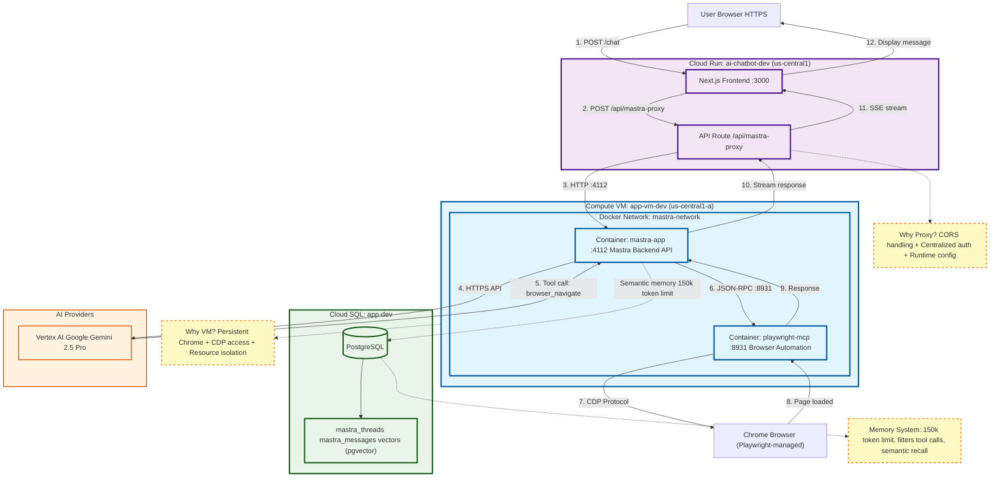
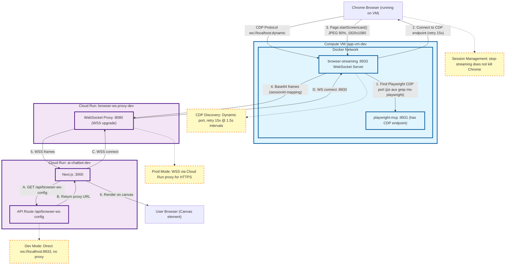
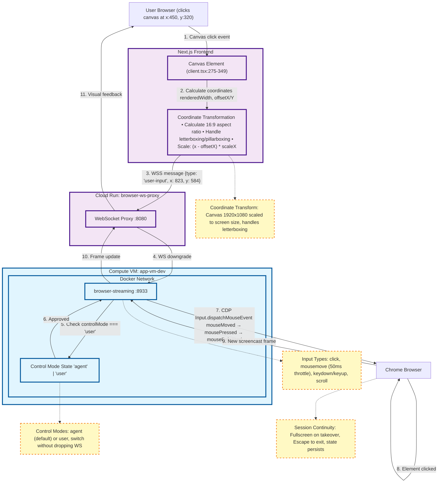
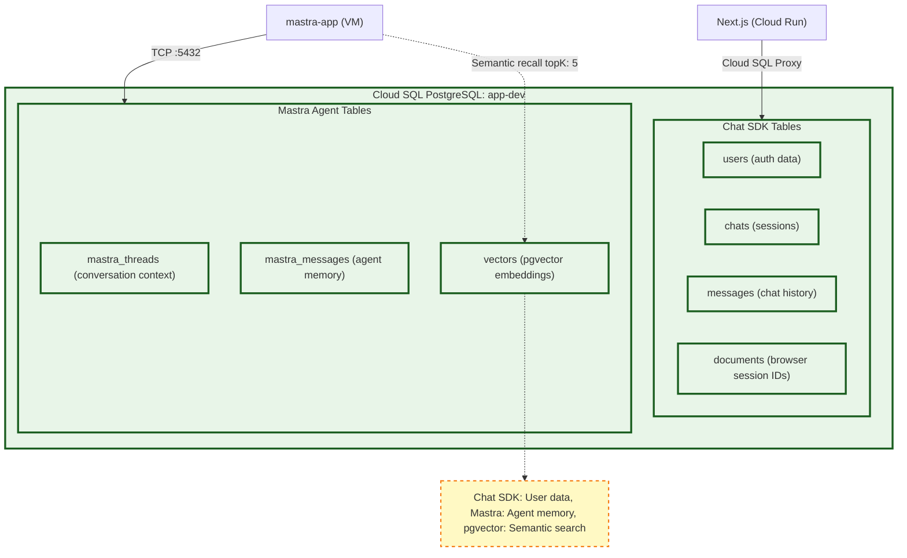

# Engineering Huddle - System Architecture Diagrams

**Purpose:** Progressive walkthrough of request flows through the system
**Presentation Strategy:** Show diagrams 1→2→3 in sequence to build understanding

---

## Diagram 1: User Request → Agent Response Flow

**Timing:** 60 seconds
**Story:** "User sends a chat message asking to navigate to a website"

**Key Talking Points:**
- **Proxy pattern**: CORS + centralized auth for Mastra API
- **VM isolation**: Chrome needs persistent process, CDP access
- **Memory system**: 150k token limit, filters tool calls, semantic recall
- **Internal Docker network**: Fast JSON-RPC communication between containers

---

## Diagram 2: Browser Streaming to Client

**Timing:** 90 seconds
**Story:** "Chrome is now running - how do we stream it to the user's browser?"

**Key Talking Points:**
- **CDP discovery challenge**: Playwright uses dynamic ports, requires process inspection
- **Retry logic**: 15 attempts @ 1.5s intervals to handle race conditions
- **Dev vs Prod**: Local bypasses proxy, production uses WSS for HTTPS compliance
- **Session persistence**: Stopping stream doesn't kill Chrome (agent still controls it)
- **Frame format**: Base64 JPEG at 80% quality, 1920x1080, every frame for smoothness

---

## Diagram 3: User Takeover Mode (Reverse Flow)

**Timing:** 60 seconds
**Story:** "User clicks 'Take control' - how does their input reach the browser?"

**Key Talking Points:**
- **Coordinate transformation**: Canvas size ≠ viewport size, requires aspect ratio math
- **Letterboxing handling**: 16:9 video in arbitrary canvas, ignore clicks in black bars
- **Control mode switching**: Agent vs user mode, no WS disconnect, server-side state
- **Input throttling**: Mousemove events limited to 50ms intervals to avoid flooding
- **Session continuity**: Takeover → fullscreen, Escape to exit, state persists

---

## Optional: Database Schema Overview

**If time permits (30 seconds)**

---

## Presentation Strategy

### Slide Progression (3-4 minutes total)

1. **Intro Slide** (15 sec)
   - "We built a real-time browser automation platform with AI agent control and human takeover"
   - "Let's walk through how a user request flows through the system"

2. **Diagram 1** (60 sec)
   - "User sends chat message → Agent navigates browser"
   - Highlight: VM isolation, proxy pattern, memory system
   - Key insight: Docker internal network for fast tool calls

3. **Diagram 2** (90 sec)
   - "Chrome is running, now stream it to the user"
   - Highlight: CDP discovery, retry logic, WSS proxy pattern
   - Key insight: Dev vs prod modes, session persistence

4. **Diagram 3** (60 sec)
   - "User takes control, clicks on browser"
   - Highlight: Coordinate transformation, control mode state
   - Key insight: Session continuity, input throttling

5. **Optional: Database Schema** (30 sec)
   - "How we manage chat history vs agent memory"
   - Highlight: Separation of concerns, pgvector for semantic recall

6. **Conclusion** (15 sec)
   - "Key challenges: CDP discovery, coordinate mapping, session management"
   - "Novel patterns: WSS proxy, dual control modes, memory filtering"

---

## Technical Annotations Summary

**Infrastructure Decisions:**
- VM for Chrome isolation + CDP access
- Cloud Run for auto-scaling frontend + WSS upgrade
- Docker network for fast inter-container communication

**Streaming Challenges:**
- CDP port discovery via process inspection
- 15-attempt retry logic for race conditions
- Base64 JPEG frames at 80% quality, 1920x1080

**User Input Challenges:**
- Coordinate transformation for aspect ratio handling
- Letterboxing/pillarboxing detection
- Input throttling (mousemove @ 50ms)
- Control mode state management

**Session Management:**
- Stop streaming ≠ kill Chrome
- WebSocket disconnect preserves browser state
- Session IDs map to browser instances
- Agent can continue working after stream stops
