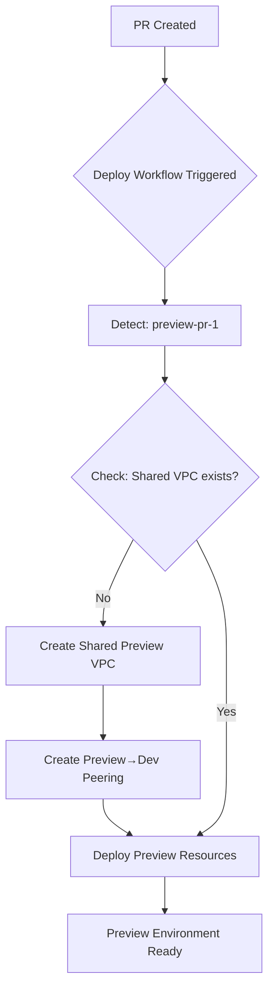
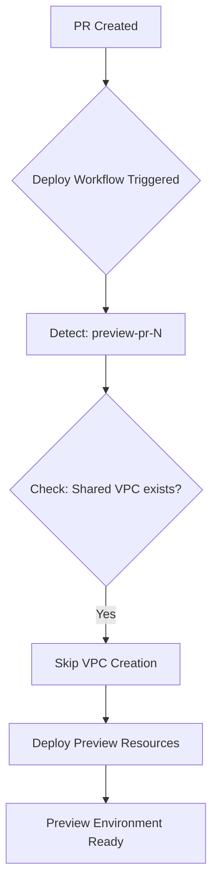
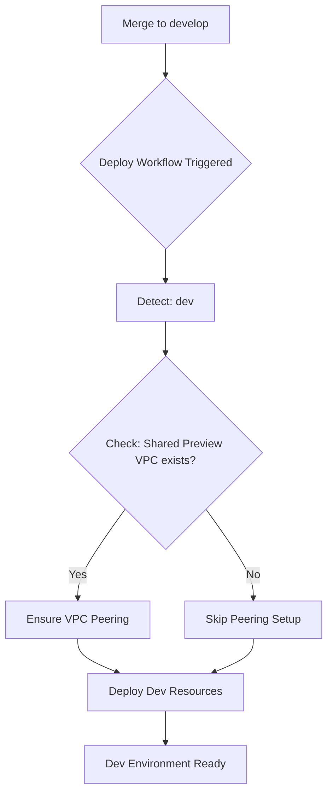

# Shared Preview VPC Architecture

## Overview

This document explains the shared VPC architecture for preview environments, including automatic deployment, VPC peering, and infrastructure organization.

## Architecture

### Previous Architecture (Individual VPCs per Preview)

```
┌──────────────┐    ┌──────────────┐    ┌──────────────┐
│  Dev VPC     │    │ Preview-PR-1 │    │ Preview-PR-2 │
│  10.0.0.0/16 │    │ 10.1.0.0/16  │    │ 10.2.0.0/16  │
└──────────────┘    └──────────────┘    └──────────────┘
       │                    │                   │
       └────────────────────┴───────────────────┘
        Dynamic VPC peering (created per PR)
```

**Problems:**
- ❌ New VPC created for each PR (~2-3 minutes)
- ❌ Dynamic peering setup/teardown required
- ❌ Complex state management with gcloud commands
- ❌ High costs (NAT gateway, VPC connector, etc. per preview)
- ❌ Slower deployments

### New Architecture (Shared Preview VPC)

```
┌──────────────────┐         ┌────────────────────────┐
│   Dev VPC        │◄───────►│ Preview Shared VPC     │
│   10.0.0.0/16    │ Peering │    10.1.0.0/16         │
│                  │ (auto)  │                        │
│ ├─ app-dev       │         │ ├─ Shared NAT Gateway  │
│ ├─ Cloud SQL Dev │         │ ├─ Shared VPC Connector│
│ └─ Subnets       │         │ └─ Subnets             │
└──────────────────┘         └────────┬───────────────┘
                                      │
                         ┌────────────┴────────────┐
                         │                         │
                   ┌─────▼──────┐          ┌──────▼─────┐
                   │ PR-1       │          │ PR-2       │
                   │ ├─ VM      │          │ ├─ VM      │
                   │ ├─ Cloud   │          │ ├─ Cloud   │
                   │ │  Run     │          │ │  Run     │
                   │ └─ Services│          │ └─ Services│
                   └────────────┘          └────────────┘

┌──────────────────┐
│   Prod VPC       │  ← Completely isolated
│   10.2.0.0/16    │
│                  │
│ ├─ app-prod      │
│ ├─ Cloud SQL Prod│
│ └─ Subnets       │
└──────────────────┘
```

**Benefits:**
- ✅ One VPC for all preview environments
- ✅ Permanent VPC peering (no dynamic setup)
- ✅ Automatic deployment via GitHub Actions
- ✅ Faster preview deployments (~30 seconds faster)
- ✅ Significant cost reduction (~$125/month per preview)
- ✅ Simplified infrastructure management

## How It Works

### Automatic Deployment Flow

#### 1. First Preview Deployment (e.g., PR #1)



**GitHub Actions Steps:**

1. **Setup** - Authenticate with GCP
2. **Deploy Shared VPC** (only if doesn't exist):
   ```bash
   cd terraform/shared-preview-vpc
   terraform init
   terraform apply -auto-approve
   ```
   - Creates `labs-asp-vpc-preview-shared`
   - Creates `preview-shared-to-dev-peering`
   - Creates `dev-to-preview-shared-peering`
3. **Deploy Preview Resources**:
   ```bash
   cd terraform
   terraform apply -var="environment=preview-pr-1"
   ```
   - VM and services deployed to shared VPC
   - Uses existing VPC connector
   - Connects to dev Cloud SQL via peering

**Duration:** ~3-4 minutes (first time, includes VPC creation)

#### 2. Subsequent Preview Deployments (e.g., PR #2, #3)



**GitHub Actions Steps:**

1. **Setup** - Authenticate with GCP
2. **Deploy Shared VPC** - Checks and skips:
   ```bash
   if gcloud compute networks describe labs-asp-vpc-preview-shared; then
     echo "✅ VPC exists, skipping..."
   fi
   ```
3. **Deploy Preview Resources** - Same as before

**Duration:** ~1-2 minutes (no VPC creation needed)

#### 3. Dev Environment Deployment (Merge to develop)



**GitHub Actions Steps:**

1. **Setup** - Authenticate with GCP
2. **Establish VPC Peering**:
   ```bash
   if gcloud compute networks describe labs-asp-vpc-preview-shared; then
     cd terraform/shared-preview-vpc
     terraform apply -auto-approve  # Ensures peering is up-to-date
   fi
   ```
3. **Deploy Dev Resources**

**Purpose:** Ensures bidirectional peering is properly configured if it was created from the preview side first.

### Where Everything Is Defined

#### Infrastructure Code

| Location | Purpose | Key Resources |
|----------|---------|---------------|
| `terraform/shared-preview-vpc/` | Shared VPC module | VPC, subnets, NAT, connector, peering |
| `terraform/vpc.tf` | VPC routing logic | Data sources, conditionals, local values |
| `terraform/cloud_sql.tf` | Database instances | Dev and Prod Cloud SQL |
| `terraform/compute.tf` | Virtual machines | VM configuration using shared VPC |
| `terraform/cloud_run.tf` | Cloud Run services | Services using shared VPC connector |

#### GitHub Actions Workflows

| File | Purpose | Triggers |
|------|---------|----------|
| `.github/workflows/deploy.yml` | Main deployment pipeline | Push to branches, PRs |

**Key Sections in `deploy.yml`:**

- **Lines 200-218**: Deploy Shared Preview VPC (for preview environments)
- **Lines 228-247**: Establish VPC Peering (for dev environment)
- **Lines 212-262**: Set VPC CIDR blocks
- **Lines 292-323**: Terraform Plan
- **Lines 325-328**: Terraform Apply

#### Configuration Files

| File | Purpose |
|------|---------|
| `terraform/shared-preview-vpc/main.tf` | Terraform backend and providers |
| `terraform/shared-preview-vpc/variables.tf` | VPC CIDR configurations |
| `terraform/shared-preview-vpc/vpc.tf` | VPC resources and peering |
| `terraform/shared-preview-vpc/outputs.tf` | VPC outputs (names, IDs, IPs) |

## Detailed Configuration

### Shared Preview VPC (10.1.0.0/16)

**File:** `terraform/shared-preview-vpc/vpc.tf`

```hcl
# Main VPC
resource "google_compute_network" "preview_shared" {
  name = "labs-asp-vpc-preview-shared"
  # ...
}

# Subnets
- Public:  10.1.0.0/20   (4,096 IPs)
- Private: 10.1.16.0/20  (4,096 IPs)
- DB:      10.1.32.0/20  (4,096 IPs)
- VPC Connector: 10.1.48.0/28 (16 IPs)

# VPC Peering (Lines 161-188)
resource "google_compute_network_peering" "preview_to_dev" {
  name = "preview-shared-to-dev-peering"
  network = google_compute_network.preview_shared.id
  peer_network = data.google_compute_network.dev_vpc.id
  # ...
}

resource "google_compute_network_peering" "dev_to_preview" {
  name = "dev-to-preview-shared-peering"
  network = data.google_compute_network.dev_vpc.id
  peer_network = google_compute_network.preview_shared.id
  # ...
}
```

### VPC Routing Logic

**File:** `terraform/vpc.tf`

```hcl
# Data sources for preview environments (Lines 10-52)
data "google_compute_network" "preview_shared" {
  count = startswith(var.environment, "preview-") ? 1 : 0
  name = "labs-asp-vpc-preview-shared"
}

# Create VPC only for dev/prod (Lines 54-62)
resource "google_compute_network" "main" {
  count = startswith(var.environment, "preview-") ? 0 : 1
  name = "labs-asp-vpc-${var.environment}"
  # ...
}

# Local values for abstraction (Lines 64-99)
locals {
  vpc_network = startswith(var.environment, "preview-") ? 
    data.google_compute_network.preview_shared[0] : 
    google_compute_network.main[0]
  
  private_subnet = startswith(var.environment, "preview-") ?
    data.google_compute_subnetwork.preview_private[0] :
    google_compute_subnetwork.private[0]
  # ...
}
```

**How it works:**
- For `preview-*` environments: Uses data sources to reference existing shared VPC
- For `dev`/`prod`: Creates dedicated VPC resources
- All other files reference `local.vpc_network` instead of direct resources

### Database Access

**File:** `terraform/cloud_sql.tf`

```hcl
# Dev Cloud SQL (Lines 9-110)
resource "google_sql_database_instance" "dev" {
  count = var.environment == "dev" ? 1 : 0
  name = "app-dev"
  
  settings {
    ip_configuration {
      ipv4_enabled = false
      private_network = local.vpc_network.id  # Uses Dev VPC
    }
  }
}

# Preview environments access dev database via VPC peering
# No Cloud SQL instance created for preview
```

**Connection Flow:**
```
Preview VM/Cloud Run
    ↓
Shared VPC Connector (10.1.48.0/28)
    ↓
VPC Peering (preview ↔ dev)
    ↓
Dev VPC (10.0.0.0/16)
    ↓
Cloud SQL (app-dev, private IP)
```

## Network Capacity

### IP Address Allocation

**Shared Preview VPC:** 10.1.0.0/16 = **65,536 IPs**

**Subnet Distribution:**
- Public subnet: 4,096 IPs
- Private subnet: 4,096 IPs (VMs deployed here)
- Database subnet: 4,096 IPs
- VPC Connector: 16 IPs
- **Free space:** ~53,232 IPs

**Per Preview Environment:**
- 1 VM: ~1-2 IPs
- Cloud Run services: 0 IPs (use shared connector)
- Containers: 0 IPs (internal Docker network)

**Capacity:** Can support **2,000+ concurrent preview environments**

## Cost Analysis

### Cost Savings per Preview Environment

**Before (Individual VPCs):**
- NAT Gateway: $45/month
- VPC Connector: $73/month
- Static IP: $7/month
- **Total: $125/month per preview**

**After (Shared VPC):**
- NAT Gateway: $45/month (shared)
- VPC Connector: $73/month (shared)
- Static IP: $7/month (shared)
- **Total: $125/month for ALL previews**

**Savings with 5 concurrent previews:** ~**$500/month**  
**Savings with 10 concurrent previews:** ~**$1,125/month**

### Additional Benefits
- Faster deployments: ~30 seconds saved per preview
- Reduced API calls to GCP
- Simplified state management

## Deployment Guide

### First Time Setup

**No manual setup required!** The shared VPC is automatically created on the first preview deployment.

### Manual Deployment (if needed)

```bash
# Deploy shared VPC manually
cd terraform/shared-preview-vpc
terraform init
terraform plan
terraform apply

# Verify VPC creation
gcloud compute networks describe labs-asp-vpc-preview-shared
```

### Verify VPC Peering

```bash
# Check preview → dev peering
gcloud compute networks peerings list --network=labs-asp-vpc-preview-shared

# Check dev → preview peering
gcloud compute networks peerings list --network=labs-asp-vpc-dev

# Expected output:
# NAME: preview-shared-to-dev-peering
# STATE: ACTIVE
# NAME: dev-to-preview-shared-peering
# STATE: ACTIVE
```

### Deploy Preview Environment

```bash
# Automatic via PR
# Just create a PR - GitHub Actions handles everything

# Or manual deployment
cd terraform
terraform init -backend-config="prefix=terraform/state/preview-pr-123"
terraform apply -var="environment=preview-pr-123"
```

## Troubleshooting

### Preview Deployment Fails: "VPC not found"

**Cause:** Shared VPC doesn't exist yet and automatic creation failed.

**Solution:**
```bash
# Check if VPC exists
gcloud compute networks describe labs-asp-vpc-preview-shared

# If not, create manually
cd terraform/shared-preview-vpc
terraform apply

# Then retry preview deployment
```

### Preview Can't Connect to Dev Database

**Cause:** VPC peering not established or not active.

**Check Peering Status:**
```bash
gcloud compute networks peerings list --network=labs-asp-vpc-preview-shared
gcloud compute networks peerings list --network=labs-asp-vpc-dev
```

**Both should show STATE: ACTIVE**

**Fix:**
```bash
# Re-apply shared VPC to fix peering
cd terraform/shared-preview-vpc
terraform apply
```

### "Network already exists" Error

**Cause:** VPC was created manually or outside Terraform.

**Solution (Import):**
```bash
cd terraform/shared-preview-vpc
terraform import google_compute_network.preview_shared labs-asp-vpc-preview-shared
terraform import google_compute_subnetwork.public labs-asp-public-preview-shared
# ... import other resources
```

### Preview Deployment is Slow

**Possible Causes:**
1. First deployment (VPC creation takes ~2 minutes)
2. Image pulls taking time
3. VM startup time

**Check:**
```bash
# View GitHub Actions logs
# Look for "Deploy Shared Preview VPC" step
# If it shows "Creating shared preview VPC..." - this is expected for first PR
# If it shows "VPC already exists, skipping" - VPC creation is not the issue
```

## Cleanup

### Destroying a Preview Environment

```bash
# Automatic via PR close
# GitHub Actions handles cleanup

# Or manual
cd terraform
terraform destroy -var="environment=preview-pr-123"
```

**Note:** Only destroys preview resources (VM, services). Shared VPC remains.

### Destroying Shared VPC

⚠️ **Only destroy when NO preview environments are active!**

```bash
# Check for active preview VMs
gcloud compute instances list --filter="name~preview"

# If none, safe to destroy
cd terraform/shared-preview-vpc
terraform destroy
```

**This will:**
- Remove VPC peering with dev
- Delete shared VPC and all subnets
- Delete NAT gateway and VPC connector
- **All active preview environments will break!**

## Migration from Old Architecture

If you have existing preview environments with individual VPCs:

### Step 1: Destroy Existing Previews

```bash
# List active previews
gcloud compute instances list --filter="name~preview"

# Destroy each one
cd terraform
terraform destroy -var="environment=preview-pr-N"
```

### Step 2: Deploy Shared VPC

```bash
cd terraform/shared-preview-vpc
terraform apply
```

### Step 3: Redeploy Previews

```bash
# Rerun PR deployments - they'll automatically use shared VPC
# Or trigger workflow_dispatch for each preview
```

## FAQ

### Q: What happens if shared VPC is deleted while previews are active?

**A:** Preview environments will lose connectivity. VMs and services will still run but won't be able to access dev database or external services.

**Fix:** Redeploy shared VPC and restart preview services.

### Q: Can I use a different CIDR for shared VPC?

**A:** Yes, edit `terraform/shared-preview-vpc/variables.tf` before first deployment:

```hcl
variable "vpc_cidr_public" {
  default = "10.1.0.0/20"  # Change this
}
```

### Q: How do I update firewall rules for preview environments?

**A:** Edit `terraform/shared-preview-vpc/vpc.tf` (Lines 190-250) and apply:

```bash
cd terraform/shared-preview-vpc
terraform apply
```

Changes apply to all preview environments immediately.

### Q: Can dev and prod VPCs peer with the preview VPC?

**A:** Only dev VPC has peering with preview VPC (for database access). Prod VPC is **completely isolated** by design.

### Q: What if I need more than 2,000 preview environments?

**A:** Increase the shared VPC CIDR from `/16` to `/14` or `/12`:

```hcl
# terraform/shared-preview-vpc/vpc.tf
# Change from 10.1.0.0/16 to 10.0.0.0/14
# Provides 262,144 IPs instead of 65,536
```

## References

- [Google Cloud VPC Documentation](https://cloud.google.com/vpc/docs)
- [VPC Peering Best Practices](https://cloud.google.com/vpc/docs/vpc-peering)
- [Cloud SQL Private IP](https://cloud.google.com/sql/docs/mysql/private-ip)
- [Terraform Google Provider](https://registry.terraform.io/providers/hashicorp/google/latest/docs)

## Support

For issues or questions:
1. Check GitHub Actions logs for detailed error messages
2. Review this documentation
3. Check `terraform/shared-preview-vpc/README.md` for module details
4. Contact the infrastructure team
